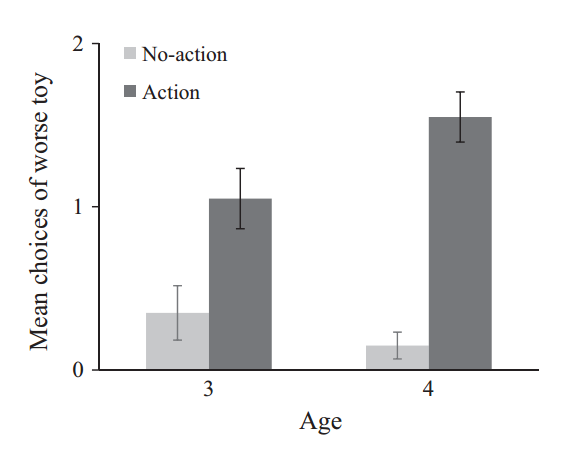

#### Article ID: sDcDq
#### Pilot: Gustav Nilsonne
#### Co-pilot: Kyle MacDonald
#### Start date: Jul 13 2017
#### End date: Aug 10 2017
#### Final verification: Tom Hardwicke
#### Date: Nov 13 2017

-------

#### Methods summary: 

Children were told two stories, with accompanying pictures shown. In each story, an agent saw two toys on a bookshelf. One toy was larger and more colorful (more attractive, in the researchers' estimation). Children were randomly assigned to an action and a non-action condition. in the action condition, the agent took the less attractive toy from the shelf, while in the no-action condition the agent did not take a toy from the shelf. Children were then shown the two toys on a blank screen and were asked to indicate which one the agent
likes more. 

------

#### Target outcomes: 
> 2.2. Results and discussion
If children infer preference from a single action, they should be more likely to indicate the worse toy when the agent takes this toy compared to when the agent does not take a toy. To examine this, children were scored 1 each time they indicated the worse toy, and 0 each time they indicated the better toy (maximum score = 2). Children’s mean scores are shown in Fig. 2.

> A 2 (condition: action, no-action) × 2 (age: 3, 4) ANOVA revealed a main effect of condition, F(1, 76) = 47.88, p < 0.001, ηp2 = 0.39, an age by condition interaction, F(1, 76) = 5.32, p = 0.024, ηp2 = 0.07, and no effect of age, F(1, 76) = 0.98, p = 0.326. The main effect of condition resulted because children were more likely to indicate the worse toy when the agent took this toy than when the agent did not take a toy from the shelf.
Follow-up analyses indicated that the difference between the conditions emerged in both age groups: 3-year-olds, t(38) = 2.82, p = 0.008, d = 0.91; 4-year-olds, t(38) = 8.05, p < 0.001, d = 2.61. These analyses also revealed that the interaction between age and condition resulted from children at both ages indicating the worse toy at similar rates in the no-action condition, t(38) = 1.08, p = 0.288, but 4-year-olds indicating it more than 3-year-olds in the action condition, t(38) = −2.08, p = 0.044, d = 0.67.

------

```{r global_options, include=FALSE}
knitr::opts_chunk$set(echo=TRUE, warning=FALSE, message=FALSE)

# prepare an empty report object, we will update this each time we run compareValues2()
reportObject <- data.frame("Article_ID" = NA, "valuesChecked" = 0, "eyeballs" = 0, "Total_df" = 0, "Total_p" = 0, "Total_mean" = 0, "Total_sd" = 0, "Total_se" = 0, "Total_ci" = 0, "Total_bf" = 0, "Total_t" = 0, "Total_F" = 0, "Total_es" = 0, "Total_median" = 0, "Total_irr" = 0, "Total_r" = 0, "Total_z" = 0, "Total_coeff" = 0, "Total_n" = 0, "Total_x2" = 0, "Total_other" = 0, "Insufficient_Information_Errors" = 0, "Decision_Errors" = 0, "Major_Numerical_Errors" = 0, "Minor_Numerical_Errors" = 0, "Major_df" = 0, "Major_p" = 0, "Major_mean" = 0, "Major_sd" = 0, "Major_se" = 0, "Major_ci" = 0, "Major_bf" = 0, "Major_t" = 0, "Major_F" = 0, "Major_es" = 0, "Major_median" = 0, "Major_irr" = 0, "Major_r" = 0, "Major_z" = 0, "Major_coeff" = 0, "Major_n" = 0, "Major_x2" = 0, "Major_other" = 0, "affectsConclusion" = NA, "error_typo" = 0, "error_specification" = 0, "error_analysis" = 0, "error_data" = 0, "error_unidentified" = 0, "Author_Assistance" = NA, "resolved_typo" = 0, "resolved_specification" = 0, "resolved_analysis" = 0, "resolved_data" = 0, "correctionSuggested" = NA, "correctionPublished" = NA)
```

## Step 1: Load packages

```{r}
library(knitr) # for kable table formating
library(CODreports) # custom report functions
library(readxl) # import excel files
library(plotrix) # to get single command for standard error
library(ez) # To perform ezANOVA
library(compute.es) # To get effect sizes for t-tests
library(tidyverse)
```

## Step 2: Load data

```{r}
data <- read_xlsx("data/data.xlsx") # This reads sheet 1, which is the right one for experiment 1
```

## Step 3: Tidy data

```{r}
data$id <- 1:80 # Specify a participant id for the purpose of ezANOVA
```

## Step 4: Run analysis

### Descriptive statistics
> 2.2. Results and discussion
If children infer preference from a single action, they should be more likely to indicate the worse toy when the agent takes this toy compared to when the agent does not take a toy. To examine this, children were scored 1 each time they indicated the worse toy, and 0 each time they indicated the better toy (maximum score = 2). Children’s mean scores are shown in Fig. 2.



```{r}
# Get means
agg <- aggregate(score ~ age + condition, data, FUN = "mean")
# Get standard errors
agg2 <- aggregate(score ~ age + condition, data, FUN = "std.error")

# Make barplot
barplot(height = agg$score[c(3, 1, 4, 2)], space = c(0.5, 0, 0.5, 0), col = c("lightgray", "darkgray"), border = NA, ylim = c(0, 2))
# Add error bars
segments(x0 = c(1, 2, 3.5, 4.5), x1 = c(1, 2, 3.5, 4.5), y0 = agg$score[c(3, 1, 4, 2)] - agg2$score[c(3, 1, 4, 2)], y1 = agg$score[c(3, 1, 4, 2)] + agg2$score[c(3, 1, 4, 2)])

```

By inspection of these plots I determine that the values MATCH (all four means and all four standard errors).

```{r}
reportObject <- compareValues2(reportedValue = "eyeballMATCH", obtainedValue = agg$score[1], valueType = 'mean')
reportObject <- compareValues2(reportedValue = "eyeballMATCH", obtainedValue = agg$score[2], valueType = 'mean')
reportObject <- compareValues2(reportedValue = "eyeballMATCH", obtainedValue = agg$score[3], valueType = 'mean')
reportObject <- compareValues2(reportedValue = "eyeballMATCH", obtainedValue = agg$score[4], valueType = 'mean')

reportObject <- compareValues2(reportedValue = "eyeballMATCH", obtainedValue = agg2$score[1], valueType = 'se')
reportObject <- compareValues2(reportedValue = "eyeballMATCH", obtainedValue = agg2$score[2], valueType = 'se')
reportObject <- compareValues2(reportedValue = "eyeballMATCH", obtainedValue = agg2$score[3], valueType = 'se')
reportObject <- compareValues2(reportedValue = "eyeballMATCH", obtainedValue = agg2$score[4], valueType = 'se')
```

### Inferential statistics

> A 2 (condition: action, no-action) × 2 (age: 3, 4) ANOVA revealed a main effect of condition, F(1, 76) = 47.88, p < 0.001, ηp2 = 0.39, an age by condition interaction, F(1, 76) = 5.32, p = 0.024, ηp2 = 0.07, and no effect of age, F(1, 76) = 0.98, p = 0.326.

```{r}
anova <- ezANOVA(data = data, wid = id, dv = score, between = .(age, condition))

# Compare degrees of freedom
reportObject <- compareValues2("1", anova[[1]]$DFn[2], valueType = 'df')
reportObject <- compareValues2("1", anova[[1]]$DFn[3], valueType = 'df')
reportObject <- compareValues2("1", anova[[1]]$DFn[1], valueType = 'df')
reportObject <- compareValues2("76", anova[[1]]$DFd[2], valueType = 'df')
reportObject <- compareValues2("76", anova[[1]]$DFd[3], valueType = 'df')
reportObject <- compareValues2("76", anova[[1]]$DFd[1], valueType = 'df')

# Compare F values
reportObject <- compareValues2("47.88", anova[[1]]$F[2], valueType = 'F')
reportObject <- compareValues2("5.32", anova[[1]]$F[3], valueType = 'F')
reportObject <- compareValues2("0.98", anova[[1]]$F[1], valueType = 'F')

# Compare p values
reportObject <- compareValues2("eyeballMATCH", anova[[1]]$p[2], valueType = 'p')
reportObject <- compareValues2("0.024", anova[[1]]$p[3], valueType = 'p')
reportObject <- compareValues2("0.326", anova[[1]]$p[1], valueType = 'p')

# Compare effect size values
reportObject <- compareValues2("0.39", anova[[1]]$ges[2], valueType = 'es')
reportObject <- compareValues2("0.07", anova[[1]]$ges[3], valueType = 'es')
```

> Follow-up analyses indicated that the difference between the conditions emerged in both age groups: 3-year-olds, t(38) = 2.82, p = 0.008, d = 0.91; 4-year-olds, t(38) = 8.05, p < 0.001, d = 2.61. These analyses also revealed that the interaction between age and condition resulted from children at both ages indicating the worse toy at similar rates in the no-action condition, t(38) = 1.08, p = 0.288, but 4-year-olds indicating it more than 3-year-olds in the action condition, t(38) = −2.08, p = 0.044, d = 0.67.

Perform t-tests

```{r}
test1 <- t.test(data$score[data$age == 3 & data$condition == 1], data$score[data$age == 3 & data$condition == 2], var.equal=T)
test2 <- t.test(data$score[data$age == 4 & data$condition == 1], data$score[data$age == 4 & data$condition == 2], var.equal=T)
test3 <- t.test(data$score[data$age == 3 & data$condition == 2], data$score[data$age == 4 & data$condition == 2], var.equal=T)
test4 <- t.test(data$score[data$age == 3 & data$condition == 1], data$score[data$age == 4 & data$condition == 1], var.equal=T)
```

Compare degrees of freedom

```{r}
reportObject <- compareValues2("38", test1$parameter, valueType = 'df')
reportObject <- compareValues2("38", test2$parameter, valueType = 'df')
reportObject <- compareValues2("38", test3$parameter, valueType = 'df')
reportObject <- compareValues2("38", test4$parameter, valueType = 'df')
```

Compare t values

```{r}
reportObject <- compareValues2("2.82", test1$statistic, valueType = 't')
reportObject <- compareValues2("8.05", test2$statistic, valueType = 't')
reportObject <- compareValues2("1.08", test3$statistic, valueType = 't')
reportObject <- compareValues2("-2.08", test4$statistic, valueType = 't')
```

Compare p values

```{r}
reportObject <- compareValues2("0.008", test1$p.value, valueType = 'p')
reportObject <- compareValues2("eyeballMATCH", test2$p.value, valueType = 'p')
reportObject <- compareValues2("0.288", test3$p.value, valueType = 'p')
reportObject <- compareValues2("0.044", test4$p.value, valueType = 'p')
```

Compare d values

```{r}
d1 <- tes(t = test1$statistic, n.1 = length(data$score[data$age == 3 & data$condition == 1]), 
          n.2 = length(data$score[data$age == 3 & data$condition == 2]))
reportObject <- compareValues2("0.91", d1$d, valueType = 'es')


d2 <- tes(t = test2$statistic, n.1 = length(data$score[data$age == 4 & data$condition == 1]), n.2 = length(data$score[data$age == 4 & data$condition == 2]))
reportObject <- compareValues2("2.61", d2$d, valueType = 'es')

# d3 is not reported
```

## Step 5: Conclusion

Replications of analyses were broadly successful. Minor numerical errors only.

```{r}
reportObject$Article_ID <- "sDcDq"
reportObject$affectsConclusion <-NA
reportObject$error_typo <- 0
reportObject$error_specification <- 0
reportObject$error_analysis <- 0
reportObject$error_data <- 0
reportObject$error_unidentified <- 0
reportObject$Author_Assistance <- F
reportObject$resolved_typo <- 0
reportObject$resolved_specification <- 0
reportObject$resolved_analysis <- 0
reportObject$resolved_data <- 0
reportObject$correctionSuggested <- NA
reportObject$correctionPublished <- NA

# decide on final outcome
if(reportObject$Decision_Errors > 0 | reportObject$Major_Numerical_Errors > 0 | reportObject$Insufficient_Information_Errors > 0){
  reportObject$finalOutcome <- "Failure"
  if(reportObject$Author_Assistance == T){
    reportObject$finalOutcome <- "Failure despite author assistance"
  }
}else{
  reportObject$finalOutcome <- "Success"
  if(reportObject$Author_Assistance == T){
    reportObject$finalOutcome <- "Success with author assistance"
  }
}

# save the report object
filename <- paste0("reportObject_", reportObject$Article_ID,".csv")
write_csv(reportObject, filename)
```

## Report Object

```{r, echo = FALSE}
# display report object in chunks
kable(reportObject[2:10], align = 'l')
kable(reportObject[11:20], align = 'l')
kable(reportObject[21:25], align = 'l')
kable(reportObject[26:30], align = 'l')
kable(reportObject[31:35], align = 'l')
kable(reportObject[36:40], align = 'l')
kable(reportObject[41:45], align = 'l')
kable(reportObject[46:51], align = 'l')
kable(reportObject[52:57], align = 'l')
```

## Session information

```{r session_info, include=TRUE, echo=TRUE, results='markup'}
devtools::session_info()
```
