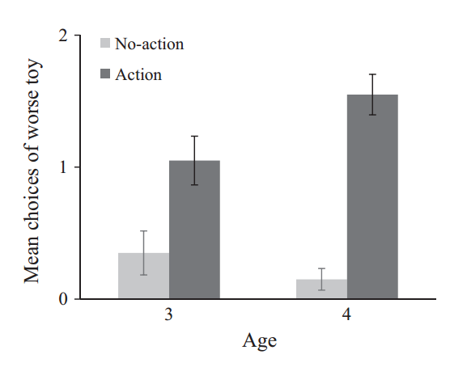

#### Article ID: sDcDq
#### Pilot: Gustav Nilsonne
#### Co-pilot: Kyle MacDonald
#### Start date: 07/13/2017
#### End date: 8/10/2017

-------

#### Methods summary: 

Children were told two stories, with accompanying pictures shown. In each story, an agent saw two toys on a bookshelf. One toy was larger and more colorful (more attractive, in the researchers' estimation). Children were randomly assigned to an action and a non-action condition. in the action condition, the agent took the less attractive toy from the shelf, while in the no-action condition the agent did not take a toy from the shelf. Children were then shown the two toys on a blank screen and were asked to indicate which one the agent
likes more. 

------

#### Target outcomes: 
> 2.2. Results and discussion
If children infer preference from a single action, they should be more likely to indicate the worse toy when the agent takes this toy compared to when the agent does not take a toy. To examine this, children were scored 1 each time they indicated the worse toy, and 0 each time they indicated the better toy (maximum score = 2). Children’s mean scores are shown in Fig. 2.

> A 2 (condition: action, no-action) × 2 (age: 3, 4) ANOVA revealed a main effect of condition, F(1, 76) = 47.88, p < 0.001, ηp2 = 0.39, an age by condition interaction, F(1, 76) = 5.32, p = 0.024, ηp2 = 0.07, and no effect of age, F(1, 76) = 0.98, p = 0.326. The main effect of condition resulted because children were more likely to indicate the worse toy when the agent took this toy than when the agent did not take a toy from the shelf.
Follow-up analyses indicated that the difference between the conditions emerged in both age groups: 3-year-olds, t(38) = 2.82, p = 0.008, d = 0.91; 4-year-olds, t(38) = 8.05, p < 0.001, d = 2.61. These analyses also revealed that the interaction between age and condition resulted from children at both ages indicating the worse toy at similar rates in the no-action condition, t(38) = 1.08, p = 0.288, but 4-year-olds indicating it more than 3-year-olds in the action condition, t(38) = −2.08, p = 0.044, d = 0.67.

------

```{r global_options, include=FALSE}
knitr::opts_chunk$set(echo=TRUE, warning=FALSE, message=FALSE)
```

## Step 1: Load packages

```{r}
library(knitr) # for kable table formating
library(CODreports) # custom report functions
library(readxl) # import excel files
library(plotrix) # to get single command for standard error
library(ez) # To perform ezANOVA
library(compute.es) # To get effect sizes for t-tests
```

## Step 2: Load data

```{r}
data <- read_xlsx("data/data.xlsx") # This reads sheet 1, which is the right one for experiment 1
```

## Step 3: Tidy data

```{r}
data$id <- 1:80 # Specify a participant id for the purpose of ezANOVA
```

## Step 4: Run analysis

### Descriptive statistics
> 2.2. Results and discussion
If children infer preference from a single action, they should be more likely to indicate the worse toy when the agent takes this toy compared to when the agent does not take a toy. To examine this, children were scored 1 each time they indicated the worse toy, and 0 each time they indicated the better toy (maximum score = 2). Children’s mean scores are shown in Fig. 2.



```{r}
# Get means
agg <- aggregate(score ~ age + condition, data, FUN = "mean")
# Get standard errors
agg2 <- aggregate(score ~ age + condition, data, FUN = "std.error")

# Make barplot
barplot(height = agg$score[c(3, 1, 4, 2)], space = c(0.5, 0, 0.5, 0), col = c("lightgray", "darkgray"), border = NA, ylim = c(0, 2))
# Add error bars
segments(x0 = c(1, 2, 3.5, 4.5), x1 = c(1, 2, 3.5, 4.5), y0 = agg$score[c(3, 1, 4, 2)] - agg2$score[c(3, 1, 4, 2)], y1 = agg$score[c(3, 1, 4, 2)] + agg2$score[c(3, 1, 4, 2)])

```

By inspection of these plots I determine that the values MATCH (all four means and all four standard errors).

### Inferential statistics

> A 2 (condition: action, no-action) × 2 (age: 3, 4) ANOVA revealed a main effect of condition, F(1, 76) = 47.88, p < 0.001, ηp2 = 0.39, an age by condition interaction, F(1, 76) = 5.32, p = 0.024, ηp2 = 0.07, and no effect of age, F(1, 76) = 0.98, p = 0.326.

```{r}
anova <- ezANOVA(data = data, wid = id, dv = score, between = .(age, condition))

# Compare degrees of freedom
compareValues(76, anova[[1]]$DFd[2])
compareValues(76, anova[[1]]$DFd[3])
compareValues(76, anova[[1]]$DFd[1])

# Compare F values
compareValues(47.88, anova[[1]]$F[2])
compareValues(5.32, anova[[1]]$F[3])
compareValues(0.98, anova[[1]]$F[1])

# Compare p values
# < 0.001 vs 1.244402e-09 - MATCH
compareValues(0.024, anova[[1]]$p[3])
compareValues(0.326, anova[[1]]$p[1])

# Compare effect size values
compareValues(0.39, anova[[1]]$ges[2])
compareValues(0.07, anova[[1]]$ges[3])
```

> Follow-up analyses indicated that the difference between the conditions emerged in both age groups: 3-year-olds, t(38) = 2.82, p = 0.008, d = 0.91; 4-year-olds, t(38) = 8.05, p < 0.001, d = 2.61. These analyses also revealed that the interaction between age and condition resulted from children at both ages indicating the worse toy at similar rates in the no-action condition, t(38) = 1.08, p = 0.288, but 4-year-olds indicating it more than 3-year-olds in the action condition, t(38) = −2.08, p = 0.044, d = 0.67.

Perform t-tests

```{r}
test1 <- t.test(data$score[data$age == 3 & data$condition == 1], data$score[data$age == 3 & data$condition == 2], var.equal=T)
test2 <- t.test(data$score[data$age == 4 & data$condition == 1], data$score[data$age == 4 & data$condition == 2], var.equal=T)
test3 <- t.test(data$score[data$age == 3 & data$condition == 2], data$score[data$age == 4 & data$condition == 2], var.equal=T)
test4 <- t.test(data$score[data$age == 3 & data$condition == 1], data$score[data$age == 4 & data$condition == 1], var.equal=T)
```

Compare degrees of freedom

```{r}
compareValues(38, test1$parameter)
compareValues(38, test2$parameter)
compareValues(38, test3$parameter)
compareValues(38, test4$parameter)
```

# Compare t values

```{r}
compareValues(2.82, test1$statistic)
compareValues(8.05, test2$statistic)
compareValues(1.08, test3$statistic)
compareValues(-2.08, test4$statistic)
```

Compare p values

```{r}
compareValues(0.008, test1$p.value, isP = T)
test2$p.value
# < 0.001 and 7.077984e-09 - MATCH
compareValues(0.288, test3$p.value, isP = T)
compareValues(0.044, test4$p.value, isP = T)
```

Compare d values

```{r}
d1 <- tes(t = test1$statistic, n.1 = length(data$score[data$age == 3 & data$condition == 1]), 
          n.2 = length(data$score[data$age == 3 & data$condition == 2]))
compareValues(0.91, d1$d)


d2 <- tes(t = test2$statistic, n.1 = length(data$score[data$age == 4 & data$condition == 1]), n.2 = length(data$score[data$age == 4 & data$condition == 2]))
compareValues(2.61, d2$d)

# d3 is not reported
```

## Step 5: Conclusion

```{r}
codReport(Report_Type = 'joint',
          Article_ID = 'sDcDq', 
          Insufficient_Information_Errors = 0,
          Decision_Errors = 0, 
          Major_Numerical_Errors = 0, 
          Minor_Numerical_Errors = 3)
```

Replications of analyses were broadly successful. Minor errors could be due to different software implementations etc.

```{r session_info, include=TRUE, echo=TRUE, results='markup'}
devtools::session_info()
```
